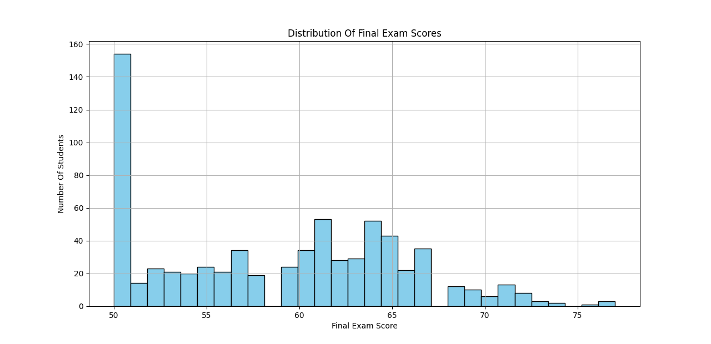
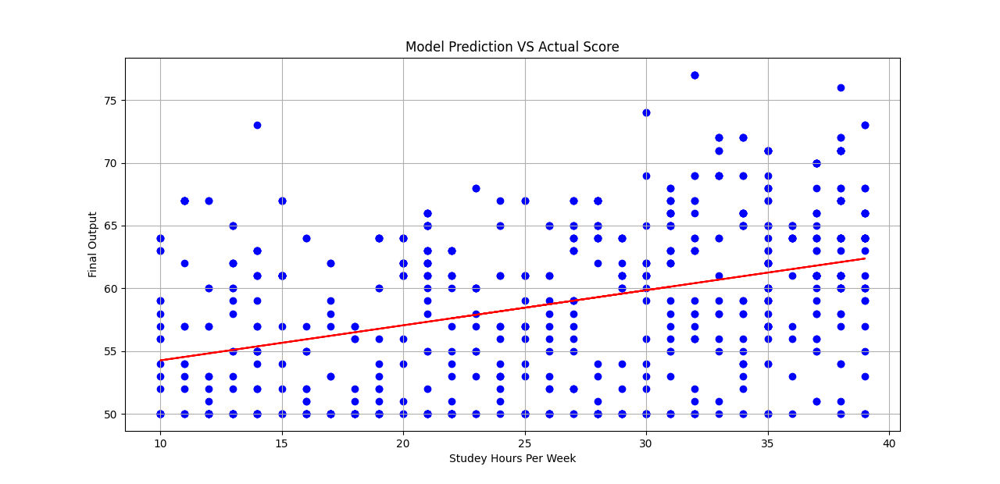

Project Overview
🎓 Student Performance Prediction using Linear Regression
This project predicts **student exam performance** based on their **weekly study hours** using a simple **Linear Regression model**.  
It also provides key evaluation metrics and visualizations to understand the model’s accuracy and data distribution.  

📊 Dataset
- The dataset used is: `student_performance_dataset.csv`  
- Features:
  - `Study_Hours_per_Week` → Number of hours a student studies in a week  
  - `Final_Exam_Score` → Final exam score of the student  

👉dataset link [https://www.kaggle.com/datasets/amrmaree/student-performance-prediction]  

---

 ⚙️ Technologies Used
- Python 🐍  
- Pandas  
- NumPy  
- Matplotlib  
- scikit-learn  

---

 🚀 Workflow
1. Load dataset  
2. Train a **Linear Regression** model  
3. Predict student exam scores  
4. Evaluate model performance using:
   - Mean Absolute Error (MAE)  
   - Mean Squared Error (MSE)  
   - Root Mean Squared Error (RMSE)  
   - R² Score (Model Accuracy)  
5. Visualize results:
   - Histogram of Final Exam Scores  
   - Scatter plot with Regression Line  

---

 📈 Results
- Provides error metrics (MAE, MSE, RMSE, R²)  
- Regression line shows relationship between study hours and exam performance  
- Example prediction:  
  > "Predicted Final Score for 9 Study Hours = 53.97785994%"  

---

 🖼️ Visualizations
- **Distribution of Final Exam Scores**  
    

- **Regression Line: Study Hours vs Exam Score**  
    
